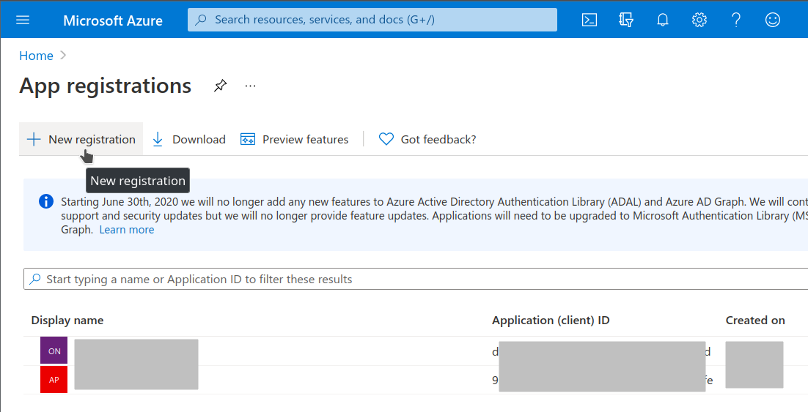
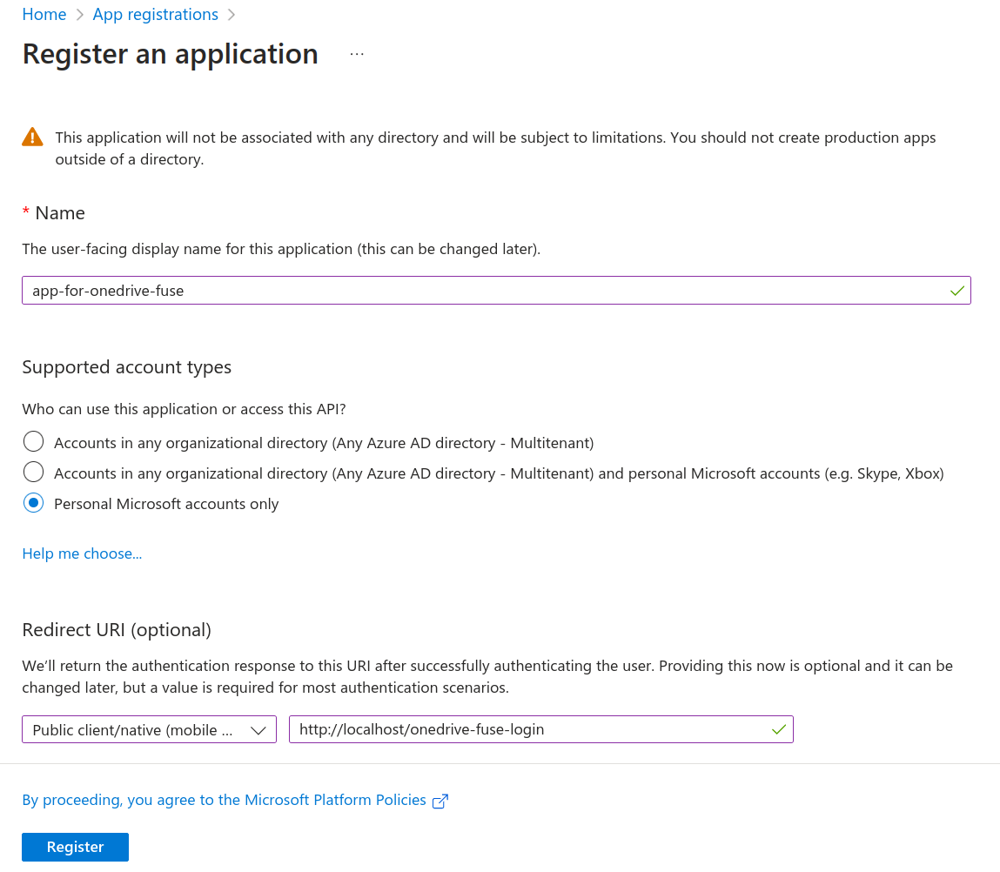
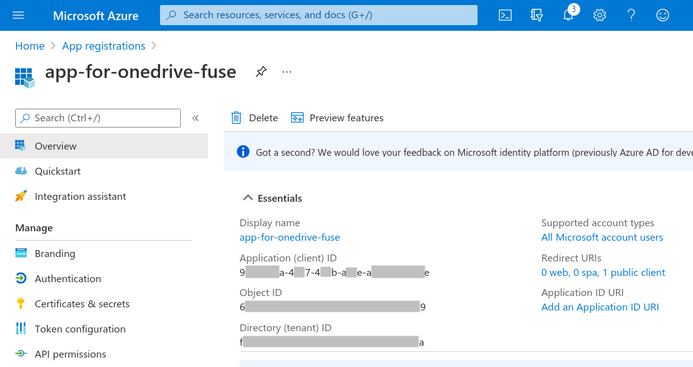

# Register and use your own Application ID

For privacy and security concern, you should register your own Application ID
and use it in `onedrive-fuse`.

Steps:

1. Login ANY of your Microsoft accounts (it doesn't need to be the account of
   your OneDrive), goto [`App Registritions` page][app_registrition]
   and click the button `New registration` on the top-left.

   

2. Fill the form.
   - `Name` can be randomly chosen.

   - `Supported account types` should be `Personal Microsoft accounts only`.

     I'm not sure whether other account types are supported since I have no
     organizational accounts for testing.

   - `Redirect URI` should be `Public client/native (mobile & desktop)` (chosen
     from the left list),
     and URL `http://localhost/onedrive-fuse-login` (the right input box).

     onedrive-fuse supports local login only. It will listen on a random port
     of the same computer during login, and successful login in browser will
     automatically callback to onedrive-fuse with the token.

   - Click `Register`

   

3. In the next page, you will see the information of your registered application.
   The UUID-format `Application (client) ID` is just what we need.
   Copy and save it for the later use.

   

   This Client ID is not really a secret, since it just identify the application.
   You still need further login to your OneDrive account to get the access token.

4. Now you can follow [README](../README.md) to login to you OneDrive account
   with the registered Client ID.

[app_registrition]: https://portal.azure.com/#blade/Microsoft_AAD_RegisteredApps/ApplicationsListBlade
